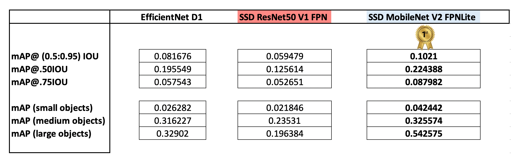
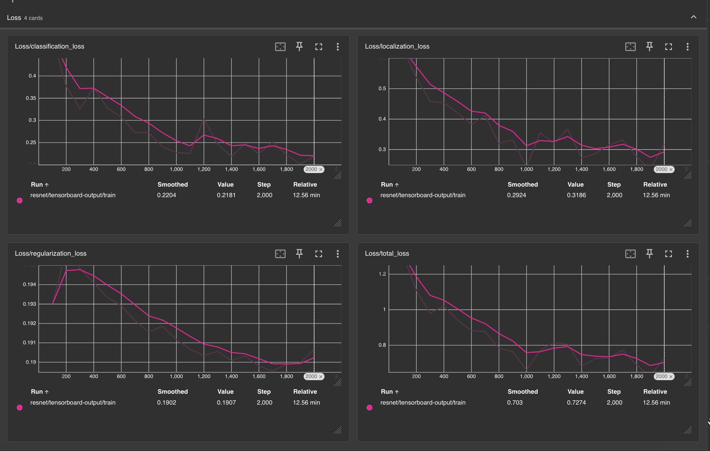

## Introduction

Object detection specifically within the context of Urban environment with varied street view imagery is a crucial task in computer vision, enabling automated identification and classification of various elements such as vehicles, pedestrians, traffic signs, and road infrastructure. This process involves leveraging deep learning models to detect objects within images and assign confidence scores based on their presence.

## Cloud Service
We would be using AWS - Amazon Web Services (AWS) for this project. Here is a brief overview of AWS and some AWS Services that would be used in this project.

Amazon Web Services (AWS) is a collection of digital infrastructure services that developers can leverage when developing their applications.

In particular we would be employing three of their AWS services for this project : 

- Sagemaker: We would use Sagemaker for running jupyter notebooks, training and deploying the model, and for inference.

- Elastic Container Registry: We would use ECR to build the Docker image and create container required for running this project.

- Simple Storage Service: We would use S3 to save logs for creating visualizations with tensorboard. Also, the data for this project is stored in a public S3 bucket.

## Dataset
The Waymo Open Dataset is a large-scale dataset designed for autonomous driving research, including image object detection. It provides high-quality sensor data collected from Waymo's self-driving vehicles, featuring camera images, LiDAR point clouds, and labeled objects such as vehicles, pedestrians, and cyclists. We would be using Waymo Open Dataset that provides on-top view camera view of the drive aacross streets - to train and evaluate computer vision models for detecting objects in real-world driving scenarios. 

We train an object detection model using the TensorFlow Object Detection API on Waymo Open Dataset. This API makes the exploration of the optimal parameters for your model extremely easy by using config files. 

To create the best possible model, we play around with and tweak and test different parameters ( hyper-parameters ) before finally concluding with an in-depth error analysis.

## Model Choices for Object Detection in Images

Three prominent models used for street view object detection are EfficientDet, MobileNet, and ResNet:

- EfficientDet: Known for its balance between accuracy and computational efficiency, EfficientDet employs a scalable architecture to enhance detection performance while minimizing resource consumption.

- ResNet: With its deep residual network structure, ResNet excels in feature extraction, enabling precise identification of complex objects and improving classification accuracy.

- MobileNet: Designed for mobile and edge computing applications, MobileNet is a lightweight model optimized for speed, making it ideal for real-time object detection in street views.

## Results

### DetectionBoxes_Precision : Precision / Accuracy Metrics

### Predicted / Actual Ground-Truth Side-By-Side Comparison

### Object Identification Comparison

<table border="0">
	<tr border="0">
	<td>
 
</td>

<td> 
</td>

<td> 
</td>
</tr>
</table>

In the above chart, we have indicated the mAP Precision values obtained across various IOUs as well as various object sizes. We oberve clearly that MobileNet performs the best in terms of precision across both IOU as well object size measures. 

While MobileNet far exceeded the other two models in almost all the measures we computed, EfficientDet did not do too badly and came in second with some of the meaasures such as 0.50 IOU and for medium-sized objects being in the range of what MobileNet had and can be attributed to it striking a balance between accuracy and computational efficiency.

### Comparison of Training Loss and Validation Loss in each Model
<table border="0">
	<tr border="0">
	<td>
 
</td>

<td> 
</td>

<td> 
</td>
</tr>
</table>

The following observations are made from the training-loss and validation loss:
For all the models - under classification loss - training loss decreases over epochs as the model learns patterns in the training data. Validation loss also decreases but may plateau or increase due to overfitting ( such as in in EfficientDet ).
The losses decreases for both the training and validation which signals the model is larning effectively but in regularization-loss we don't notice much difference as it should be - since the regularization parameters takes care of penalizing accordingly.

### Comparison of Training Loss across Models

As expected, the model comparison syncs up with the table above where the model with the highest precision for detecting object is suppoed to have a lower loss while classifying and which is what we observe. MobileNet has the highest precision in terms of mAP values across various IOU and object-size measures while have the lowest loss during classification.

## Performance Improvement : Suggested Techniques

To improve the performance of your object detection models for urban development using COCO datasets, consider the following techniques:

- Hyperparameter tuning: Optimize learning rate, batch size, and weight decay using grid search or Bayesian optimization. Adaptive learning rate methods like Adam or learning rate scheduling can also enhance training efficiency.

- Data augmentation: Apply techniques like random cropping, rotation, flipping, and color jittering to improve model generalization. Ensuring a balanced dataset with diverse urban scenes can help the models detect objects more reliably.

- Regularization: Use L2 regularization (weight decay) to prevent overfitting. Dropout layers can also be introduced, especially for deeper networks, to improve generalization.

- Model architecture pruning and quantization refinement: For ResNet, consider reducing depth or using ResNet variations like ResNeXt or EfficientNet for better feature extraction. EfficientDet can benefit from BiFPN tuning to enhance feature fusion.

- Anchor box optimization and proposal adjustments: Optimize anchor box sizes and aspect ratios specific to urban objects. Fine-tuning the number of proposals for EfficientDet and MobileNet can improve detection accuracy for different object scales.

These refinements should enhance detection performance, especially in urban environments with complex structures and diverse object sizes. 

Here are five key performance improvement techniques for object detection in urban development using MobileNet, EfficientDet, and ResNet models:

- Hyperparameter tuning: Optimize learning rate, batch size, and weight decay using techniques like grid search or Bayesian optimization. MobileNet benefits from fine-tuning depth multipliers, while EfficientDet requires careful scaling of backbone and box/class networks.

- Regularization: Apply dropout (especially for MobileNet) and L2 weight regularization to prevent overfitting. EfficientDet and ResNet can benefit from batch normalization, ensuring stable training and improved generalization.

- Data augmentation: Enhance model robustness by applying transformations like rotation, scaling, contrast adjustments, and motion blur—common distortions in urban environments.

- Model pruning and quantization: Reduce computational cost and improve inference speed by pruning unnecessary neurons and quantizing weights, especially useful for MobileNet when deployed on edge devices.

- Anchor box optimization: Fine-tune anchor box sizes for EfficientDet and ResNet-based detectors to better capture diverse urban objects like cars, pedestrians, and buildings, leading to improved localization accuracy.

If you're tackling deployment challenges, integrating post-processing refinements like non-max suppression optimization and adaptive thresholding can further boost precision in complex urban scenes. Hope this helps!

---

## Summary

---

Based on the results of the three models evaluated for object detection in an urban environment, the SSD MobileNet V2 FPNLite model performed the best with an mAP@(0.5:0.05:0.95) IOU of 0.09543, outperforming both the EfficientNet D1 and SSD ResNet50 V1 FPN models.

In terms of detecting small objects like cyclists and pedestrians, the SSD MobileNet V2 FPNLite also had the highest mAP, indicating its ability to detect smaller objects better than the other models. However, the EfficientNet D1 had the highest mAP for large objects, suggesting that it may perform better in detecting larger objects like e.g nearby cars.

The three models had poor performance in detecting cyclists. This may be a result due to the skewness of the dataset, where cars are the dominant class in the dataset, and the cyclists class is the least abundant.

Overall, the model selection process showed that different models have different strengths and weaknesses in object detection, and choosing the right model for a specific application requires careful consideration of the type and size of the objects to be detected. Additionally, the results suggest that the ResNet50 model may not be the best choice for object detection in an urban environment, at least not without further optimization and tuning.

Here are the training losses of the 3 experiments:

The plots show that the 3 models could achieve better loss if we increased the n. of training steps because there is room for convergence.

## Future Work & Possible Improvement

By applying these models to street view images, objects can be identified and assigned confidence scores, aiding in applications such as smart city planning, autonomous driving, and surveillance. Each model offers distinct advantages depending on the requirements of computational efficiency, accuracy, and deployment environment.

We identified several potential avenues for improving performance, but they would require additional resources and a higher computing budget. These include:
- Increase the training steps: Each model was trained for only 2000 steps, which is relatively low for such kinds of data and complex architectures. So, increasing the number of training steps till the loss reaches the plateau can further improve performance.
- Data augmentation: techniques such as flipping, scaling, and random cropping. More advanced techniques such as color jittering, rotation, and translation can also be used to improve the model's accuracy.
- Hyperparameter tuning: Fine-tuning the hyperparameters can potentially improve the model's performance.
- Handling occlusion and partial object detection: In this project, we focused on detecting complete objects. However, in an urban environment, objects are often partially occluded or obstructed. Developing techniques to handle partial object detection can further improve the model's performance.

Write a brief summary of your experiments and suggest the best model for this problem. This should include the accuracy (mAP) values of the models you tried. Also, discuss the following:

- How does the validation loss compare to the training loss?
- Did you expect such behavior from the losses/metrics?
- What can you do to improve the performance of the tested models further?

