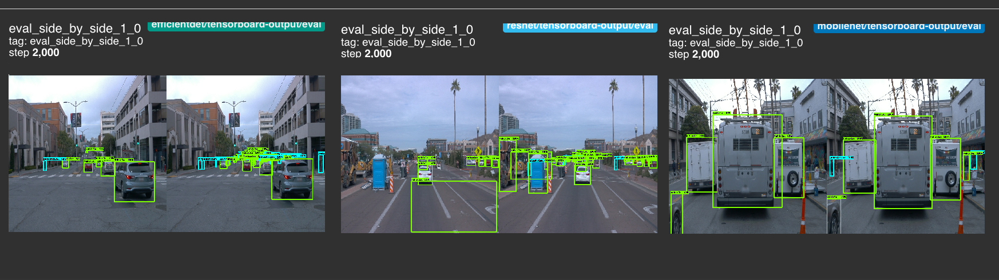

## Introduction

Object detection specifically within the context of urban environment with varied street view imagery is a crucial task in computer vision, enabling automated identification and classification of various objects such as vehicles, pedestrians, traffic signs, and road infrastructure. This process involves leveraging deep learning models to detect objects within images and assign confidence scores based on their presence. We train a bunch of object detection models using the TensorFlow Object Detection API on Waymo Open Dataset and determine the best model based on its pros and cons.

## Cloud Service
We would be using AWS - Amazon Web Services (AWS) for this project. Here is a brief overview of AWS and some AWS Services that would be used in this project.

In particular we would be employing three of their AWS services for this project : 

- Sagemaker: For running jupyter notebooks, training and deploying the model, and for inference.

- Elastic Container Registry: To build the Docker image and create container required for running this project.

- Simple Storage Service: To save logs for creating visualizations with tensorboard. Also, the data for this project is stored in a public S3 bucket.

## Dataset
The Waymo Open Dataset is a large-scale dataset designed for autonomous driving research, including image object detection. It provides high-quality sensor data collected from Waymo's self-driving vehicles, featuring camera images, LiDAR point clouds, and labeled objects such as vehicles, pedestrians, and cyclists. We would be using Waymo Open Dataset that also provides on-top view camera view of the drive across streets - to train and evaluate computer vision object detection model for detecting objects within an urban environment.

To create the best possible model, we play around with and tweak and test different parameters ( hyper-parameters ) before finally concluding with an in-depth error analysis.

## Object Detection : Model Choices

Three prominent models used for street view object detection are MobileNet, EfficientDet and ResNet:

- EfficientDet: Known for its balance between accuracy and computational efficiency, EfficientDet employs a scalable architecture to enhance detection performance while minimizing resource consumption.

- ResNet: With its deep residual network structure, ResNet excels in feature extraction, enabling precise identification of complex objects and improving classification accuracy.

- MobileNet: Designed for mobile and edge computing applications, MobileNet is a lightweight model optimized for speed, making it ideal for real-time object detection in street views.

## Results

### DetectionBoxes_Precision : Precision / Accuracy Metrics

### Predicted / Actual Ground-Truth Side-By-Side Comparison ( within each Model )

### Object Identification Comparison ( across Models )

<table border="0">
	<tr border="0">
	<td>
 
</td>

<td> 
</td>

<td> 
</td>
</tr>
</table>

In the above chart, we have indicated the mAP Precision values obtained across various IOUs as well as various object sizes. We oberve clearly that MobileNet performs the best in terms of precision across both IOU as well object size measures. 

While MobileNet far exceeded the other two models in almost all the measures (IOU and object-sizes) we computed, EfficientDet did not do too badly and came in second with some of the meaasures such as 0.50 IOU and for medium-sized objects being in the range of what MobileNet had.

### Comparison of Training Loss and Validation Loss ( in each Model )
<table border="0">
	<tr border="0">
	<td>
 
</td>

<td> 
</td>

<td> 
</td>
</tr>
</table>

The following observations are made from the training-loss and validation loss:
For all the models - under classification loss - training loss decreases over epochs as the model learns patterns in the training data. Validation loss also decreases but plateaus or increases due to overfitting ( such as in in EfficientDet ).

The losses decreases for both the training and validation which signals the model is learning effectively but in regularization-loss we don't notice much difference as it should be - since the regularization parameters takes care of penalizing accordingly.

### Comparison of Training Loss ( across Models )

As expected, the model comparison syncs up with the table above where the model with the highest precision for detecting object is supposed to have a lower loss while classifying and which is what we observe. MobileNet has the highest precision in terms of mAP values across various IOU and object-size measures while having the lowest loss during classification.

## Performance Improvement : Key Strategies

Improving the performance of object detection models in urban environments requires a combination of hyperparameter tuning, regularization techniques, and architectural adjustments. 
Here are some key strategies to enhance the performance of MobileNet, EfficientDet, and ResNet:

- Hyperparameter tuning: Optimize learning rate, batch size, and weight decay using grid search or Bayesian optimization. Adaptive learning rate methods like Adam or learning rate scheduling can also enhance training efficiency.

- Data augmentation: Apply techniques like random cropping, rotation, flipping, and color jittering to improve model generalization. Ensuring a balanced dataset with diverse urban scenes can help the models detect objects more reliably.

- Regularization: Use L2 regularization (weight decay) to prevent overfitting. Dropout layers can also be introduced, especially for deeper networks, to improve generalization.

- Model architecture pruning and quantization refinement: For ResNet, consider reducing depth or using ResNet variations like ResNeXt or EfficientNet for better feature extraction. EfficientDet can benefit from BiFPN tuning to enhance feature fusion.

- Anchor box optimization and proposal adjustments: Optimize anchor box sizes and aspect ratios specific to urban objects. Fine-tuning the number of proposals for EfficientDet and MobileNet can improve detection accuracy for different object scales.

These refinements should enhance detection performance, especially in urban environments with complex structures and diverse object sizes. 

