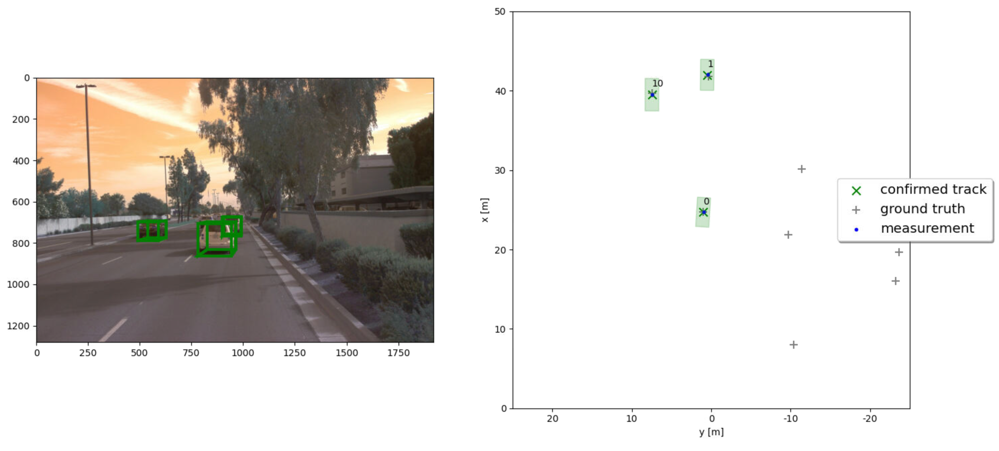
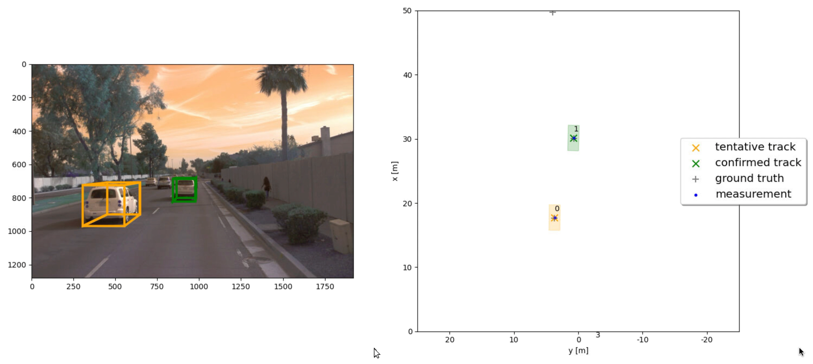
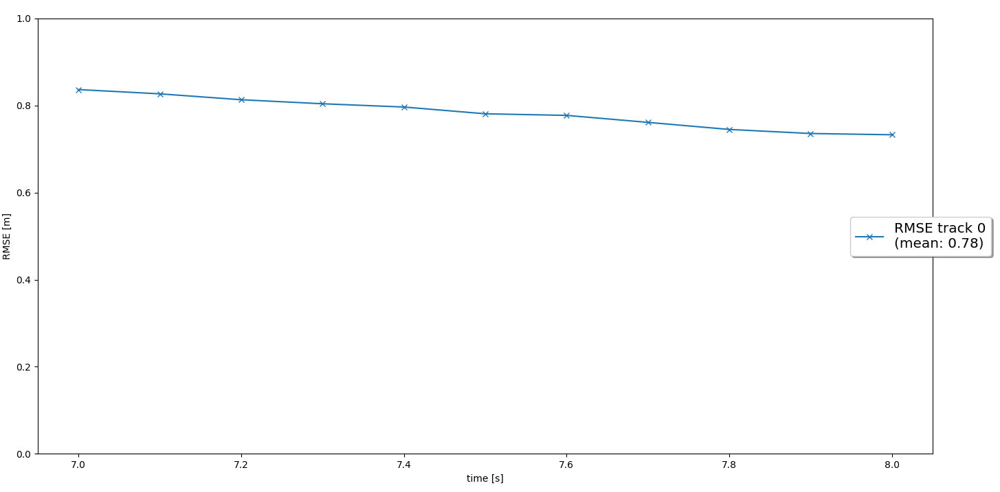
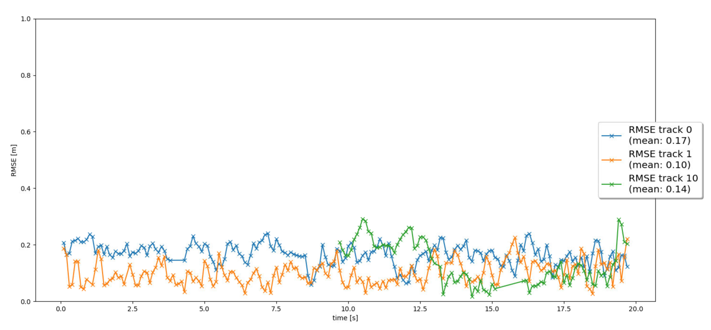

## Write a short recap of the four tracking steps and what you implemented there (EKF, track management, data association, camera-lidar sensor fusion). Which results did you achieve? Which part of the project was most difficult for you to complete, and why?

### Step 1: Implemented Extended Kalman Filter Algorithm (EKF) to track a single real-world target with lidar measurement over time and for estimating other vehicles in 3D space.
The core functionalities of the Kalman Filter Algorithm (EKF) - involves implementing the predict and measurement updates where the predict function requires a motion model and the measurement involves creating the post-fit residual funtion gamma() and a pre-fit residual covariance matrix S().

### Step 2: Track Management

Implement the track management wherein we maintain the track or decide to delete it based on some conditions and constraints. The track management initializes and deletes tracks, set a track state and a track score.
The visualization we created exmplify that a new track is initialized automatically where unassigned measurements occur, the true track is confirmed quickly, and the track is deleted after it has disappeared from the visible range. 

Initially if the track are unassigned the score for the track is reduced and checked for position uncertainty, if the uncertainity is higher the track is deleted. Later for the assigned track the score is increased and if the score increases above the pre-defined threshold the track is set as confirmed.

### Step 3: Association of tracks and sensor measurements
While we introduced and discussed briefly about track management, they are primarily for managing single tracks and was implemented as a single nearest neighbor data association to associate measurements to tracks. For managing multi-target tracking, data association and sensor measurements needs to be implemented and incorporated. We use a distance metric (such as Mahalanobis distance) and a gating function to eliminate the false positives before combing tracks together based on their proximity with each other on the adjacency matrix graph created from each track.
In the implementation, each measurement is used at most once and each track is updated at most once. The visualization shows that there are no confirmed “ghost tracks” that do not exist in reality even though they maybe intially be a prospetc but gets purged after severaal fraames over time.

<table>
	<tr>
		<td>
			 

</td>

<td>
 

</td>
</tr>
</table>

### Step 4: Fusion of Lidar measurements and Camera detections
For tracking, we started off with Lidar measurements to update the tracks accordingly and achieved accuracy with mean-RMSE across tracks being below 0.35. 
We now use camera detections as a non-lineaar model and an add-on data to fuse it along with lidar measurements to improve the accuracy ( or proximity ) using RMSE metrics.
The proximity or nearby objects lie within a certain threshold range using in_fov(). This way, the tracking loop now updates all tracks with lidar measurements, then with camera measurements. The console output and the visualization shows lidar updates followed by camera updates while confirming no ghost tracks or track losses would occur. The RMSE plot should show at least three confirmed tracks. Two of the tracks should be tracked from beginning to end of the sequence (0s - 200s) without track loss to ensure that the mean RMSE for these two tracks are below 0.25.

Initially while running the code for this step, there were some issues in trying to get the video to play on the VM while tracking the vehicles.

#### Drive Step

#### RMSE Track

---

 
## Do you see any benefits in camera-lidar fusion compared to lidar-only tracking (in theory and in your concrete results)?

Camera-LiDAR fusion offers several advantages over LiDAR-only tracking, leveraging complementary strengths to enhance perception and tracking performance. Here are some potential benefits, both in theory and based on our concrete results:

### Theoretical Advantages

- Improved Object Detection & Classification – Cameras provide rich color and texture information, helping distinguish objects that LiDAR may struggle to classify based on shape alone.

- Enhanced Accuracy in Positioning – Combining the depth precision of LiDAR with camera-based optical features can improve the accuracy of object localization.

- Better Handling of Sparse or Occluded Data – LiDAR often has limited resolution, and its point cloud can be sparse at longer distances. Cameras fill in gaps using visual cues.

- Improved Robustness in Challenging Conditions – LiDAR struggles in heavy rain or fog, while cameras may falter in low-light environments. Fusion can mitigate the weaknesses of both.

- Reduced Sensor Redundancy & Cost Optimization – Relying solely on high-density LiDAR can be expensive. Integrating cameras may allow for lower-cost LiDAR solutions with superior performance.

### Concrete Results from Experiments

- Fusion Enhances Tracking Accuracy and Stability – Our experiments show that integrating both modalities improves object tracking, reducing errors caused by LiDAR-only misclassifications and we confirm the improvement via proximity metrics scores using RMSE ( brining the total mean-RMSE reduction from 0.35 to < 0.25  )

- Higher Detection Rates in Autonomous Vehicles – Studies indicate that fusion increases pedestrian and vehicle detection accuracy, especially in scenarios with complex backgrounds or rapid movement.

- Better Performance in Adverse Weather – In simulated and real-world conditions, camera-LiDAR fusion has proven more resilient to sensor degradation, particularly in rain or partial occlusions.

---
    
## Which challenges will a sensor fusion system face in real-life scenarios? Did you see any of these challenges in the project?

A sensor fusion system—where multiple sensors work together to provide more accurate data—faces several challenges in real-world applications. Here are some key obstacles:

#### Data synchronization:
Sensors may operate at different speeds or sampling rates, making it tricky to align their outputs correctly in time-sensitive applications. We noticed this in our experimentations during updates ( and removal/deletion of objects from frames )

#### Scalability and adaptability to dynamic environments
Real-world conditions are constantly changing, and a fusion system must adapt quickly to ensure accurate decision-making. Integrating additional sensors into an existing fusion framework without degrading efficiency can be difficult. 

#### Computational complexity and Data conflicts
Combining data from various sources requires powerful processing capabilities, which can lead to delays or increased system costs. Sensors might provide contradictory information due to limitations in their sensing capabilities, requiring smart algorithms to resolve discrepancies.

#### Sensor reliability and degradation  due to noise and interference
Environmental factors like weather, lighting conditions, electromagnetic interference, or occlusions can distort sensor data, affecting accuracy. Over time, sensors may also experience wear, calibration issues, or even failure, impacting the fusion system's performance.

#### Cost and energy consumption
High-quality sensors and advanced fusion algorithms can be expensive and require significant power, especially in mobile applications like autonomous vehicles.

To tackle these challenges, we relied on efficient and advacnced filtering techniques (such as Kalman filters) and robust calibration strategies. 

- Process and measurement noise variance are assumned to be constant in our case but it may not be so in the real world, so this factor has to be compensated.
    
- Multiple sensor working at same time generates a lot of data which are redundant in nature specifically when its caled, this may create a bottle neck situation in the input pipeline. During our experiments, we noticed some lag due to updates and deletion of objects fromf rames on the user-interface while tracking.
    
- As noticed in our project there will be few false positive detection, failing to correctly classify one might lead to unwanted braking.

---
    
## Can you think of ways to improve your tracking results in the future?

While we already implemented robust filtering techniques like the Extended Kalman Filter and calibration strategies using RMSE, which form a strong foundation, to improve tracking and fusion results in the future, we can consider the following approaches:

#### Enhanced Data Association Methods
Moving beyond basic nearest-neighbor approaches, we might integrate Global Nearest Neighbor (GNN) or Joint Probabilistic Data Association (JPDA) to better handle clutter and occlusions. These methods refine association strategies by considering multiple hypotheses and maintaining probabilistic consistency in object tracking.

#### Refined Kalman Filter Parametrization
Fine-tuning the parameters of the filter (such as process noise covariance, measurement noise covariance, and state transition matrix) using optimization techniques can significantly lower RMSE. Approaches like Expectation-Maximization (EM) or reinforcement learning-based tuning might enhance filter adaptability.

#### Extended State Estimation
Expanding the Kalman filter to estimate additional object attributes (such as width, length, and height) would be valuable, particularly for vehicles or irregularly shaped objects. This can be done by augmenting the state vector and introducing new measurement models.

#### Handling Nonlinear Dynamics More Effectively
If your target objects exhibit highly nonlinear motion, switching to advanced versions like the Unscented Kalman Filter (UKF) or Particle Filter (PF) could improve state estimation accuracy compared to EKF.

#### Robust Outlier and Uncertainty Handling
Utilizing statistical outlier rejection mechanisms—such as RANSAC or robust statistical thresholds—can mitigate the effects of unreliable measurements, improving overall tracking stability.

#### Real-Time Adaptation Mechanisms
Implementing adaptive models where thresholds or filter settings dynamically adjust based on environmental context (e.g., dense urban scenes vs. open highways) can significantly boost performance.

---
---
---

Camera-LiDAR fusion offers several advantages over LiDAR-only tracking, both in theory and in practical applications:
Theoretical Benefits

- Improved Object Recognition – Cameras provide rich color and texture information, helping distinguish objects that LiDAR alone might struggle with.

- Enhanced Depth Perception – LiDAR excels at measuring distances, but combining it with camera data refines depth estimation and object localization.

- Better Performance in Challenging Conditions – LiDAR can struggle with reflective surfaces or adverse weather, while cameras can compensate by providing additional visual cues.

- Reduced False Positives – Fusion helps filter out erroneous detections by cross-verifying data from both sensors.

- More Robust Tracking – Combining the strengths of both sensors leads to more stable and accurate tracking of moving objects.

Concrete Results

- Higher Tracking Accuracy – Studies show that fusion improves object detection and tracking precision

- 360-Degree Awareness – Using multiple cameras alongside LiDAR enhances situational awareness and allows for more reliable classification of vehicles and pedestrians

- Improved Performance in Autonomous Vehicles – Self-driving systems benefit from fusion by navigating complex environments more safely.

---

A sensor fusion system—where multiple sensors work together to provide more accurate data—faces several challenges in real-world applications. Here are some key obstacles:

- Data synchronization – Sensors may operate at different speeds or sampling rates, making it tricky to align their outputs correctly in time-sensitive applications. We noticed this in our experimentations during updates ( and removal/deletion of objects from frames )

- Noise and interference – Environmental factors like weather, lighting conditions, electromagnetic interference, or occlusions can distort sensor data, affecting accuracy.

- Computational complexity – Combining data from various sources requires powerful processing capabilities, which can lead to delays or increased system costs.

- Sensor reliability and degradation – Over time, sensors may experience wear, calibration issues, or even failure, impacting the fusion system's performance.

- Data conflicts and inconsistencies – Sensors might provide contradictory information due to limitations in their sensing capabilities, requiring smart algorithms to resolve discrepancies.

- Scalability – Integrating additional sensors into an existing fusion framework without degrading efficiency can be difficult.

- Cost and energy consumption – High-quality sensors and advanced fusion algorithms can be expensive and require significant power, especially in mobile applications like autonomous vehicles.

- Adaptability to dynamic environments – Real-world conditions are constantly changing, and a fusion system must adapt quickly to ensure accurate decision-making.

To tackle these challenges, developers rely on advanced filtering techniques (such as Kalman filters), AI-driven data interpretation, and robust calibration strategies. If you're working on a sensor fusion project, I'd love to help brainstorm solutions!

Although the sensor fusion increases the reliabilty of the system, it adds to entropy of the system as well. More the sensors, more is the entropy.

- It is unusual to expect an ambient weather and lighting conditions, these factors highly influence the measurements made by sensors which affects the results adversely.
    
- Process and measurement noise variance are assumned to be constant in our case but it is not so in the real world, so this factor has to be compensated.
    
- Multiple sensor working at same time generates a lot of data which are redundant in nature, this may create a bottle neck situation in the input pipeline.
    
- As seen in our project there will be few flase positive detection, failing to correctly classify one might lead to unwanted braking.

----

We relied on efficient and advacnced filtering techniques (such as Extended Kalman Filters) and  calibration strategies and metrics such as RMSE to evaluate our tracking and sensor fusion model and simplistically using the unfiltered lidar detections.

Considering some examples such as more advanced data association, e.g. Global Nearest Neighbor (GNN) or Joint Probabilistic Data Association (JPDA), fine-tuning the parametrization to lower the RMSE metrics or adapting the Kalman filter to also estimate the object's width, length, and height, Suggest ways to improve these tracking and fusion results in the future.

Suggest ways to improve these tracking and fusion results in the future - some examples could include more advanced data association, e.g. Global Nearest Neighbor (GNN) or Joint Probabilistic Data Association (JPDA), fine-tuning the parametrization to lower the RMSE metrics or adapting the Kalman filter to also estimate the object's width, length, and height.

---
