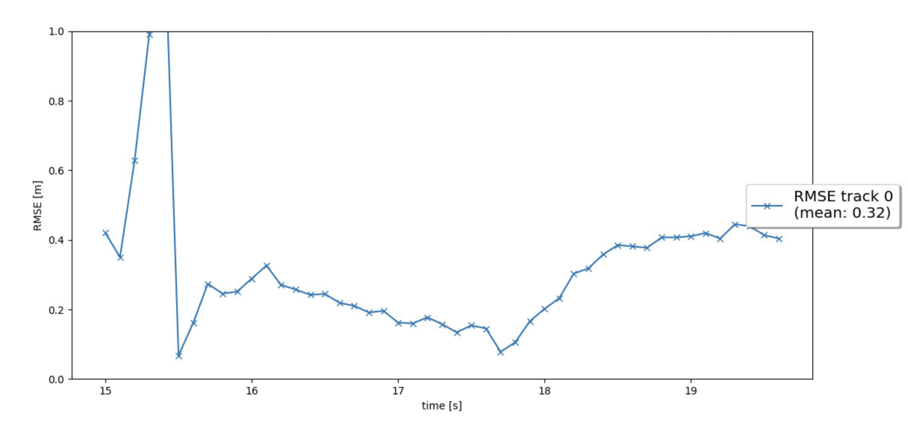

## Write a short recap of the four tracking steps and what you implemented there (EKF, track management, data association, camera-lidar sensor fusion). Which results did you achieve? Which part of the project was most difficult for you to complete, and why?

### Step 1: Implemented Extended Kalman Filter Algorithm (EKF) to track a single real-world target with lidar measurement over time and for estimating other vehicles in 3D space.
The core functionalities of the Kalman Filter Algorithm (EKF) - involves implementing the predict and measurement updates where the predict function requires a motion model and the measurement involves creating the post-fit residual funtion gamma() and a pre-fit residual covariance matrix S().

### Step 2: Track Management

Implement the track management wherein we maintain the track or decide to delete it based on some conditions and constraints. The track management initializes and deletes tracks, set a track state and a track score.
The visualization we created exmplify that a new track is initialized automatically where unassigned measurements occur, the true track is confirmed quickly, and the track is deleted after it has disappeared from the visible range. 

Initially if the track are unassigned the score for the track is reduced and checked for position uncertainty, if the uncertainity is higher the track is deleted. Later for the assigned track the score is increased and if the score increases above the pre-defined threshold the track is set as confirmed.

### Step 3: Association of tracks and sensor measurements
While we introduced and discussed briefly about track management, they are primarily for managing single tracks and was implemented as a single nearest neighbor data association to associate measurements to tracks. For managing multi-target tracking, data association and sensor measurements needs to be implemented and incorporated. We use a distance metric (such as Mahalanobis distance) and a gating function to eliminate the false positives before combing tracks together based on their proximity with each other on the adjacency matrix graph created from each track.
In the implementation, each measurement is used at most once and each track is updated at most once. The visualization shows that there are no confirmed “ghost tracks” that do not exist in reality even though they maybe intially be a prospetc but gets purged after severaal fraames over time.

<table>
	<tr>
		<td>
			 

</td>

<td>
 

</td>
</tr>
</table>

### Step 4: Fusion of Lidar measurements and Camera detections
For tracking, we started off with Lidar measurements to update the tracks accordingly and achieved accuracy with mean-RMSE across tracks being below 0.35. 
We now use camera detections as a non-lineaar model and an add-on data to fuse it along with lidar measurements to improve the accuracy ( or proximity ) using RMSE metrics.
The proximity or nearby objects lie within a certain threshold range using in_fov(). This way, the tracking loop now updates all tracks with lidar measurements, then with camera measurements. The console output and the visualization shows lidar updates followed by camera updates while confirming no ghost tracks or track losses would occur. The RMSE plot should show at least three confirmed tracks. Two of the tracks should be tracked from beginning to end of the sequence (0s - 200s) without track loss to ensure that the mean RMSE for these two tracks are below 0.25.

Initially while running the code for this step, there were some issues in trying to get the video to play on the VM while tracking the vehicles.

#### Drive Step

#### RMSE Track

---

 
### Do you see any benefits in camera-lidar fusion compared to lidar-only tracking (in theory and in your concrete results)?

Camera-LiDAR fusion offers several advantages over LiDAR-only tracking, both in theory and in practical applications:
Theoretical Benefits

- Improved Object Recognition – Cameras provide rich color and texture information, helping distinguish objects that LiDAR alone might struggle with.

- Enhanced Depth Perception – LiDAR excels at measuring distances, but combining it with camera data refines depth estimation and object localization.

- Better Performance in Challenging Conditions – LiDAR can struggle with reflective surfaces or adverse weather, while cameras can compensate by providing additional visual cues.

- Reduced False Positives – Fusion helps filter out erroneous detections by cross-verifying data from both sensors.

- More Robust Tracking – Combining the strengths of both sensors leads to more stable and accurate tracking of moving objects.

Concrete Results

- Higher Tracking Accuracy – Studies show that fusion improves object detection and tracking precision

- 360-Degree Awareness – Using multiple cameras alongside LiDAR enhances situational awareness

- Better Object Classification – Fusion allows for more reliable classification of vehicles and pedestrians

- Improved Performance in Autonomous Vehicles – Self-driving systems benefit from fusion by navigating complex environments more safely

sensor fusion aims to overcome the limitations of individual sensors by gathering and fusing data from multiple sensors to produce more reliable information with less uncertainty. In our case there 2 sensor LIDAR and camera.

Camera are very good at behavioural analysis like for traffic signal or sign detection, pedestrian crossing, lane segmentation etc.,. But it is highly dependent on the lighting and weather condition. LIDAR is very good at the perception tasks like object detection, range estimation for collision avoidance etc.,. But it is highly prone to errors that may occur due to vibrations and also it requires lot of calibration.

With the help of sensor fusion system becomes more reliable as multiple sensor with different capabilities are used which can compensate for drawbacks of each other.

    
### Which challenges will a sensor fusion system face in real-life scenarios? Did you see any of these challenges in the project?

A sensor fusion system—where multiple sensors work together to provide more accurate data—faces several challenges in real-world applications. Here are some key obstacles:

- Data synchronization – Sensors may operate at different speeds or sampling rates, making it tricky to align their outputs correctly in time-sensitive applications.

- Noise and interference – Environmental factors like weather, lighting conditions, electromagnetic interference, or occlusions can distort sensor data, affecting accuracy.

- Computational complexity – Combining data from various sources requires powerful processing capabilities, which can lead to delays or increased system costs.

- Sensor reliability and degradation – Over time, sensors may experience wear, calibration issues, or even failure, impacting the fusion system's performance.

- Data conflicts and inconsistencies – Sensors might provide contradictory information due to limitations in their sensing capabilities, requiring smart algorithms to resolve discrepancies.

- Scalability – Integrating additional sensors into an existing fusion framework without degrading efficiency can be difficult.

- Cost and energy consumption – High-quality sensors and advanced fusion algorithms can be expensive and require significant power, especially in mobile applications like autonomous vehicles.

- Adaptability to dynamic environments – Real-world conditions are constantly changing, and a fusion system must adapt quickly to ensure accurate decision-making.

To tackle these challenges, developers rely on advanced filtering techniques (such as Kalman filters), AI-driven data interpretation, and robust calibration strategies. If you're working on a sensor fusion project, I'd love to help brainstorm solutions!

Although the sensor fusion increases the reliabilty of the system, it adds to entropy of the system as well. More the sensors, more is the entropy.

- It is unusual to expect an ambient weather and lighting conditions, these factors highly influence the measurements made by sensors which affects the results adversely.
    
- Process and measurement noise variance are assumned to be constant in our case but it is not so in the real world, so this factor has to be compensated.
    
- Multiple sensor working at same time generates a lot of data which are redundant in nature, this may create a bottle neck situation in the input pipeline.
    
- As seen in our project there will be few flase positive detection, failing to correctly classify one might lead to unwanted braking.

    
### Can you think of ways to improve your tracking results in the future?

 - Implement a more advanced data association, e.g. Global Nearest Neighbor (GNN) or Joint Probabilistic Data Association (JPDA)
    
 - Adapt the Kalman filter to also estimate the object's width, length, and height, instead of simply using the unfiltered lidar detections as we did.
    
 - Fine-tune the parameterization and see how low an RMSE can be achieved. One idea would be to apply the standard deviation values for lidar that found in the mid-term project.

Fine-tune your parameterization and see how low an RMSE you can achieve! One idea would be to apply the standard deviation values for lidar that you found in the mid-term project. The parameters in misc/params.py should enable a first running tracking, but there is still a lot of room for improvement through parameter tuning!

- Implement a more advanced data association, e.g. Global Nearest Neighbor (GNN) or Joint Probabilistic Data Association (JPDA).
    
- Feed your camera detections from Project 1 to the tracking.

- Adapt the Kalman filter to also estimate the object's width, length, and height, instead of simply using the unfiltered lidar detections as we did.

- Use a non-linear motion model, e.g. a bicycle model, which is more appropriate for vehicle movement than our linear motion model, since a vehicle can only move forward or backward, not in any direction.

---
