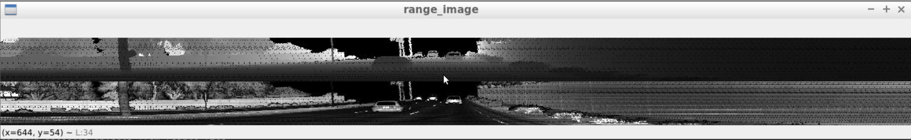
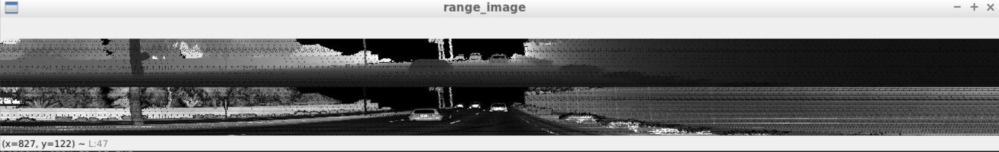
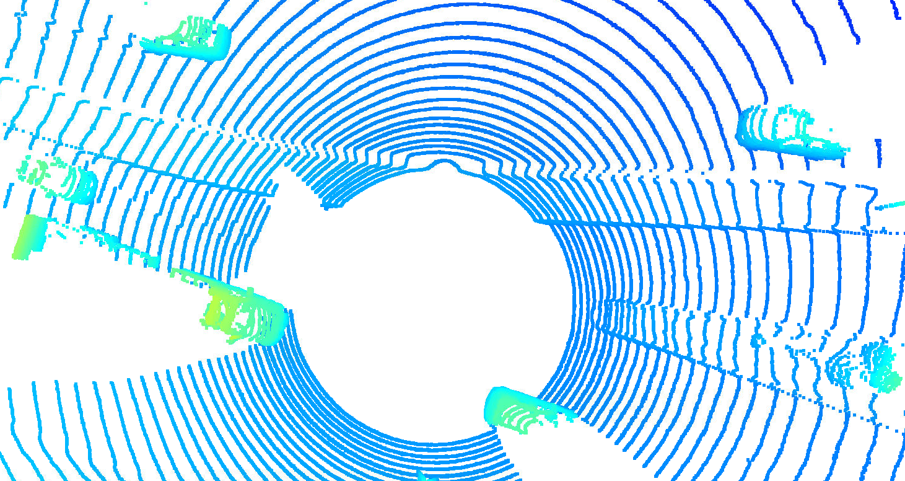
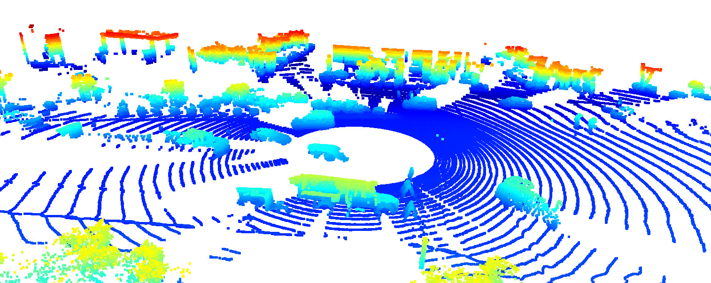
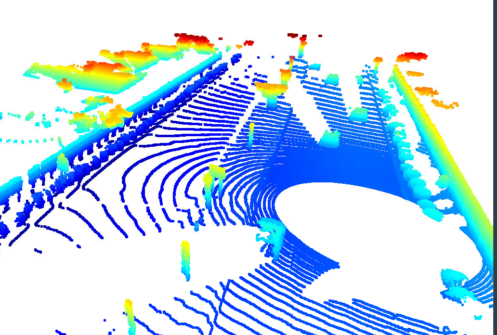
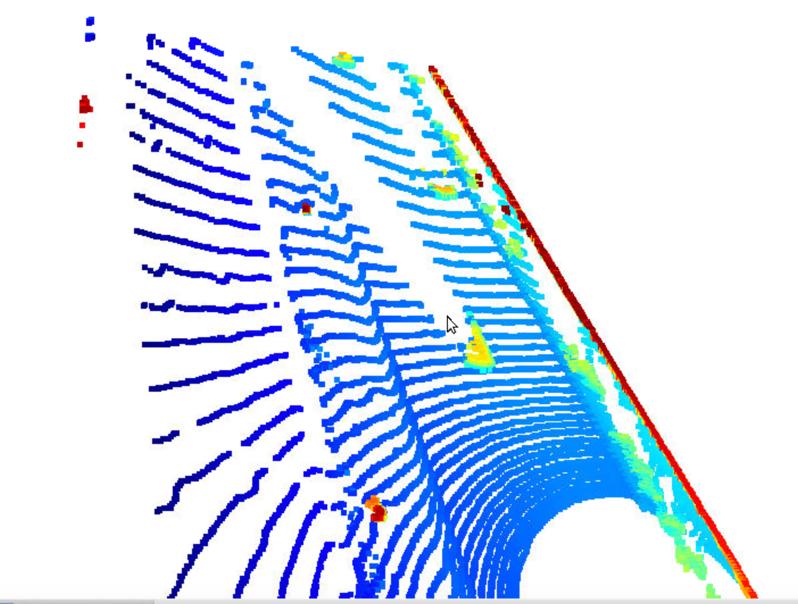
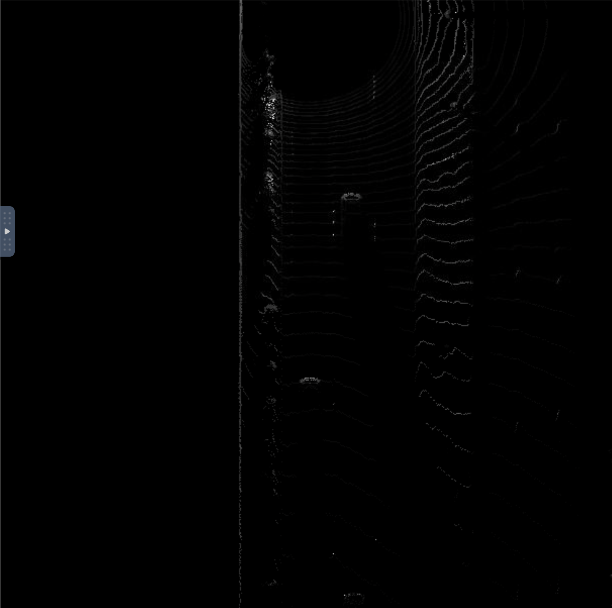
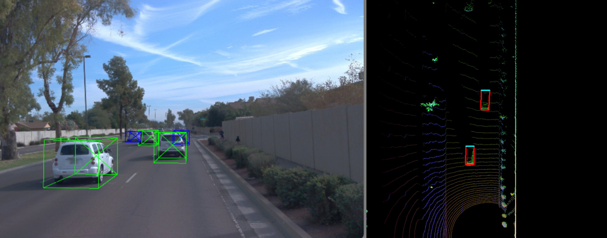

# Sensor Fusion - 3D Object Detection

#### In this post, we do a deep-learning approach for detecting vehicles in LiDAR data based on a birds-eye view perspective of the 3D point-cloud. We also employ a series of performance measures to evaluate the performance of the detection approach. We use Waymo Open dataset for processing the lidars across four sections of this post to : 

- Section 1 : Compute Lidar Point-Cloud from Range Image
- Section 2 : Create Birds-Eye View from Lidar PCL
- Section 3 : Model-based Object Detection in BEV Image
- Section 4 : Performance Evaluation for Object Detection

---

## Section 1 : Compute Lidar Point-Cloud from Range Image

### Visualize range image channels (ID_S1_EX1)

In the Waymo Open dataset, lidar data is stored as a range image. We are extracting two of the data channels within the range image, which are "range" and "intensity", and convert the floating-point data to an 8-bit integer value range. We use the OpenCV library to stack the range and intensity image vertically and visualize it.

#### Range Image : Data Channel/Frame 0 

#### Range Image: Data Channel/Frame 1 

### Visualize lidar point-cloud (ID_S1_EX2)

After computing the range image, we use the Open3D library to display the lidar point-cloud in a 3d viewer in order to develop a feel for the nature of lidar point-clouds. We use the viewer to locate and closely inspect point-clouds on vehicles to summarize the following items:

- To Zoom in and rotate the open3d display window on VM to capture the vehicle images by panning and zooming the point-cloud.
- To find and display 10 examples of vehicles with varying degrees of visibility in the point-cloud
- Identify vehicle features that appear as a stable feature on most vehicles (e.g. rear-bumper, tail-lights) and describe them briefly. Also, use the range image viewer from the last example to underpin your findings using the lidar intensity channel.     

#### Lidar Animation for Zooming/Panning the Point Clouds : Zoom in and rotate the open3d display window on VM to capture the vehicle images

#### Lidar Point Cloud 1

#### Lidar Point Cloud 2

#### Lidar Point Cloud 3

#### Lidar Point Cloud 4

#### Lidar Point Cloud 5

#### Lidar Point Cloud 6

#### Lidar Point Cloud 7

#### Lidar Point Cloud 8

#### Lidar Point Cloud 9

#### Lidar Point Cloud 10

We notice from these list of 10 point-cloud images as well as in various parts of the above animation - that the significant and visible parts that appear in the LIDAR point cloud are the lamps in the vehicles whether it be - headlights, tail lamps, bumper, front light. The angles from the side view shows the car windows and mirrors when closely observed in certain point-clouds (pleaase also refer to animation for panning and zooming for such angles ).

---

## Section 2 : Create Birds-Eye View from Lidar PCL

In this section, first we create a birds-eye view (BEV) perspective of the lidar point-cloud. Based on the (x,y)-coordinates in sensor space, respective coordinates within the BEV coordinate space are computed the the actual BEV map can be filled with lidar data from the point-cloud. The corresponding height and intensity map of the same is computed as well, which are shown below

### Convert sensor coordinates to BEV-map coordinates (ID_S2_EX1)
We perform the first step in creating a birds-eye view (BEV) perspective of the lidar point-cloud. Based on the (x,y)-coordinates in sensor space, we compute the respective coordinates within the BEV coordinate space so that  subsequently, the actual BEV map can be filled with lidar data from the point-cloud.

#### Lidar Point Cloud

### Compute intensity and height layer of the BEV map (ID_S2_EX2)

We fill the "intensity" channel of the BEV map with data from the point-cloud. In order to do so, we identify all points with the same (x,y)-coordinates within the BEV map and then assign the intensity value of the top-most lidar point to the respective BEV pixel. Also, we normalize the resulting intensity image using percentiles, in order to make sure that the influence of outlier values (very bright and very dark regions) is sufficiently mitigated and objects of interest (e.g. vehicles) are clearly separated from the background.

####  Visualizing Intensity layer and height layer of the BEV map (ID_S2_EX3)
We then fill the "height" channel of the BEV map with data from the point-cloud. In order to do so, please make use of the sorted and pruned point-cloud lidar_pcl_top from the previous step and normalize the height in each BEV map pixel by the difference between max. and min. height which is defined in the configs structure.

---

## Section 3 : Model-based Object Detection in BEV Image

### Add a second model (ID_S3_EX1)
The model-based detection of objects in lidar point-clouds using deep-learning is a heavily researched area with new approaches appearing in the literature. 

We illustrate how a new model can be integrated into an existing framework. 

### Extract 3D bounding boxes from model response (ID_S3_EX2)
As the model input is a three-channel BEV map, the detected objects will be returned with coordinates and properties in the BEV coordinate space. Thus, before the detections can move along in the processing pipeline, they need to be converted into metric coordinates in vehicle space. W e then perform this conversion such that all detections have the format [1, x, y, z, h, w, l, yaw], where 1 denotes the class id for the object type vehicle.

#### 3D bounding boxes added to the images

---

## Section 4 : Performance Evaluation for Object Detection

### Compute intersection-over-union(IOU) between labels and detections (ID_S4_EX1)
We then find pairings between ground-truth labels and detections, so that we can determine wether an object has been (a) missed (false negative), (b) successfully detected (true positive) or (c) has been falsely reported (false positive). Based on the labels within the Waymo Open Dataset, the geometrical overlap between the bounding boxes of labels and detected objects are computed and the percentage of this overlap in relation to the area of the bounding boxes determined. A default method in the literature to arrive at this value is called intersection over union(IOU).

### Compute false-negatives and false-positives (ID_S4_EX2)
Based on the pairings between ground-truth labels and detected objects, the goal of this task is to determine the number of false positives and false negatives for the current frame. After all frames have been processed, an overall performance measure will be computed based on the results produced in this task.

### Compute precision and recall (ID_S4_EX3)
After processing all the frames of a sequence, the performance of the object detection algorithm shall now be evaluated. To do so in a meaningful way, the two standard measures "precision" and "recall" will be used, which are based on the accumulated number of positives and negatives from all frames.

#### Graphing performance metrics

#### Using the labels, metrics should get perfect scores

---